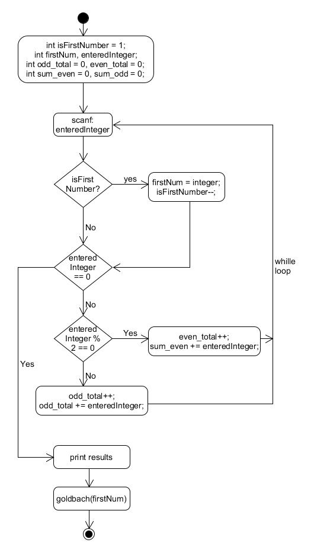
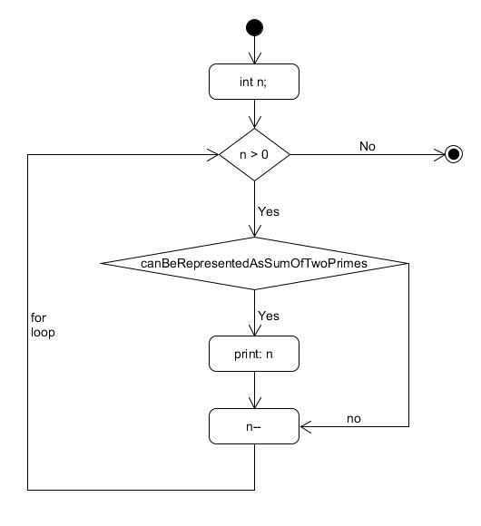
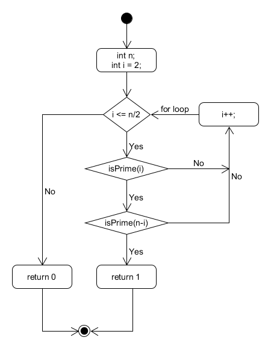
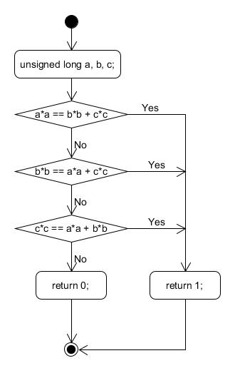

# C assignment 2. Parts A and B.
03/30/2019  
Armandas Rokas (s185144)  
Github readme link: https://github.com/ArmandasRokas/C_assigment_2/blob/master/docs/readme.md 
## Even_odd function
Firstly, the function has counters for the total sum of even numbers and odd numbers. Secondly there are also two more counters, which holds the values of how many times odd number and even number was entered.
When user exits decides to terminate the progam it divides the sum of even/odd numbers by the number of times entered even/odd numbers and prints results. 
### Difficulties  
There was a bug which was caused by division by 0, when no even or odd numbers was added. The bug is fixed by adding extra selection statments at the end of program, which checks if  the number of times entered even/add numbers is not equal to 0. 
### The flowchart of even_odd function

## Goldbach function
The goldbanch fuction prints all natural numbers less tha n, which cannot be represented as a sum of two prime numbers.   
The function itself just iterates n times in checks, if the n can be represnted as a sum of two prime numbers by taking advantage of another function, which its explain below. 

### The flowchart of goldbach function

## CanBeRepresentedAsSumOfTwoPrimes function
The function takes a parameter n and checks n can be presented by sum as sum of two primes.  The function iterates at maximum n/2 times. It tries to find a prime numbers which is less than half of n. Than it subtracts from n and checks if the result is prime number. If so that means function can be represented as sum of two primes and returns 1, which means 'true'.
### The flow diagram of canBeRepresentedAsSumOfTwoPrimes function

## IsPrime function
Again the function takes n as paramater, iterates n/2 and uses modulus to defines if the number can be devided by a current i and get a whole number. If not a such case exists, so the number is prime. 
### The flowchart of isPrime function

# Part C
## IsRightTriangle function
The function takes three numbers as paramter and uses Pythagorean theorem to find out if there exists a right triangle
### The flowchart of isRightTriangle function

