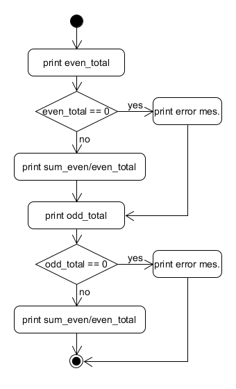

    
03/30/2019
 

Armandas Rokas (s185144) 

 
 
 
 

<h1>
    C assignment 2
    </h1> 
    
Parts A,  B and C

 
 
 
 

 

**Table of contents**

- [Intro](#intro)
- [Part A](#part-a)
  * [Even_odd function](#even-odd-function)
  * [Difficulties in implementing even_odd function](#difficulties-in-implementing-even-odd-function)
- [Part B](#part-b)
  * [Goldbach function](#goldbach-function)
  * [CanBeRepresentedAsSumOfTwoPrimes function](#canberepresentedassumoftwoprimes-function)
  * [IsPrime function](#isprime-function)
- [Part C](#part-c)
  * [IsRightTriangle function](#isrighttriangle-function)
- [Conclusion](#conclusion)

 

## Intro

This document describes the implementation of "Assignment 2. A, B and C parts" solution. 

## Part A
### Even_odd function
Firstly, the function has counters for the total sums of even numbers and odd numbers. Next, there are also two more counters, which holds the values of how many times odd number and even number was entered.
When user exits decides to terminate the program it divides the sum of even/odd numbers by the number of times entered even/odd numbers and prints results. 

 

### Difficulties in implementing even_odd function  
There was a bug which was caused by division by 0, when no even or odd numbers was added. The bug is fixed by adding extra selection statements at the end of program, which checks if the number of times entered even/add numbers is not equal to 0.  This is shown at the flow diagram below.

 

## Part B
### Goldbach function
The goldbanch function prints all natural numbers less than `n`, which cannot be represented as a sum of two prime numbers.   
The function itself just iterates `n` times and checks, if the n can be represented as a sum of two prime numbers by taking advantage of another function called `canBeRepresentedAsSumOfTwoPrimes`, which its explained below. 

 

### CanBeRepresentedAsSumOfTwoPrimes function
The function takes a parameter `n` and checks, if `n` can be presented as sum of two primes.  The function iterates at maximum `n/2` times. It tries to find a prime numbers which is less than half of `n`. Than it subtracts from`n` and checks if the result is prime number. If so that means function can be represented as sum of two primes and returns 1, which means 'true'. The flow diagram below tries to illustrate that. 

 

### IsPrime function
Again the function takes `n` as parameter, iterates `n/2` times and uses modulus to defines if the number can be divided by a current `i` and get a whole number. If not a such case exists, so the number is prime. 

 

## Part C
### IsRightTriangle function
The function takes three numbers as parameter, which are sides of triangle.  There was used `Pythagorean theorem` to find out if there exists a right triangle. The flow diagram below tries to illustrate that. 

 

## Conclusion

The main goal to develop all problems in Assignment 2 was accomplished, although there were some difficulties in the process. 

In general, the task was very challenging and time consuming, but it gave an opportunity to use learned knowledge from `C` courses like arithmetic operators, handling of OI operations, iteration statements, selection statements and much more. So I satisfied both on the result of the program and the learning process.  

